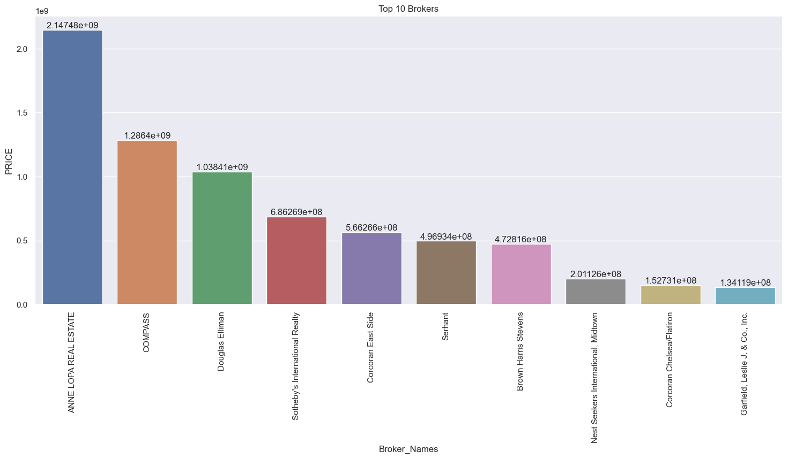
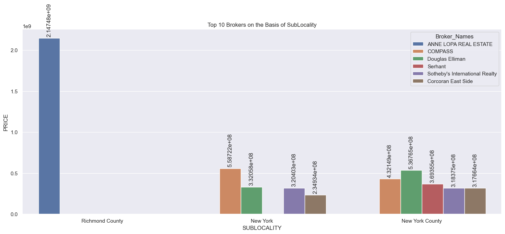
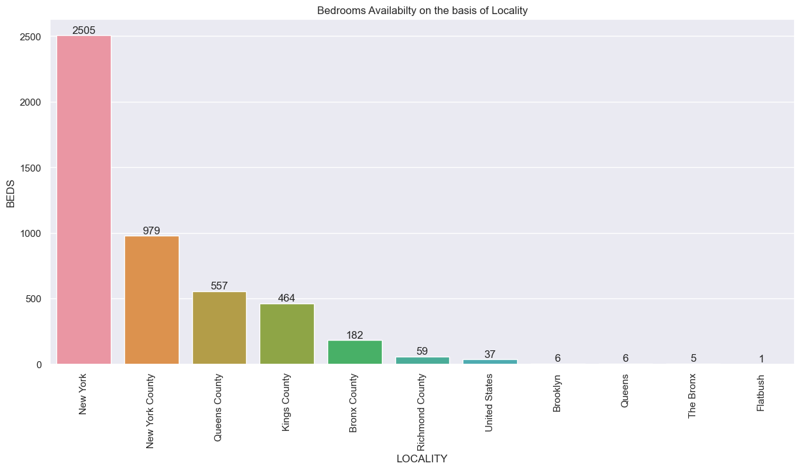
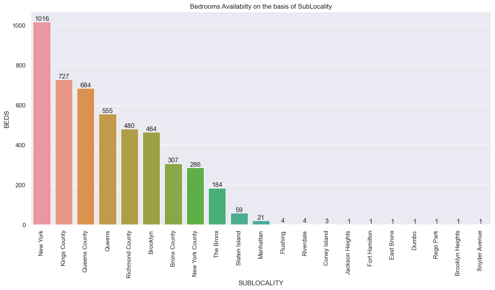
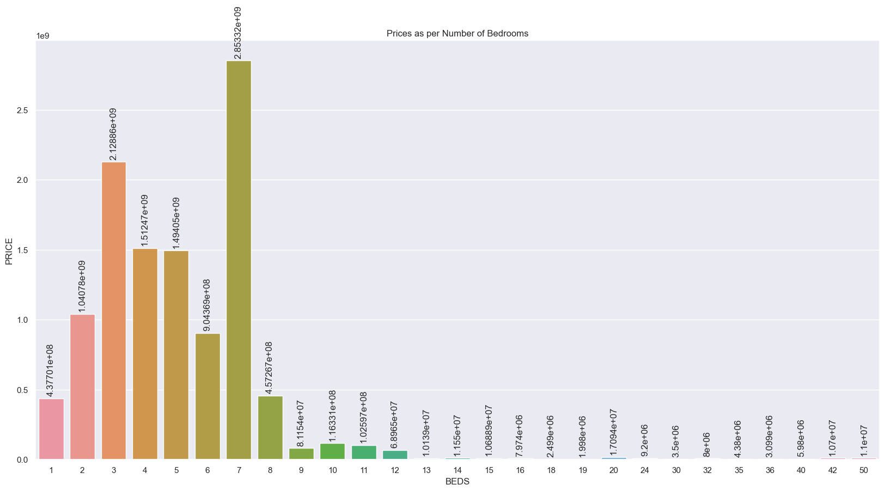
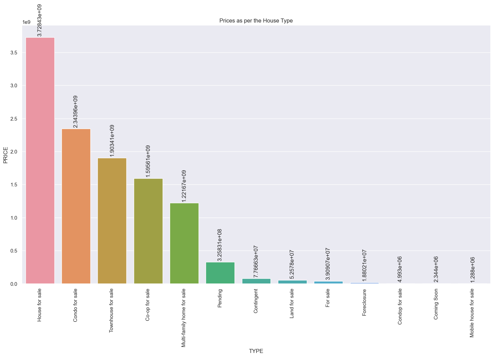

# `NEW YORK HOUSING DATASET`
### `About the Dataset`
* `BROKERTITLE`: Title of the broker
* `TYPE`: Type of the house
* `PRICE`: Price of the house
* `BEDS`: Number of bedrooms
* `BATH`: Number of bathrooms
* `PROPERTYSQFT`: Square footage of the property
* `ADDRESS`: Full address of the house
* `STATE`: State of the house
* `MAIN_ADDRESS`: Main address information
* `ADMINISTRATIVE_AREA_LEVEL_2`: Administrative area level 2 information
* `LOCALITY`: Locality information
* `SUBLOCALITY`: Sublocality information
* `STREET_NAME`: Street name
* `LONG_NAME`: Long name
* `FORMATTED_ADDRESS`: Formatted address
* `LATITUDE`: Latitude coordinate of the house
* `LONGITUDE`: Longitude coordinate of the house

### `Dataset link:` [Link](https://www.kaggle.com/datasets/nelgiriyewithana/new-york-housing-market)

### Findings 
#### 1. Dataset
- There are 4081 rows and 17 columns.
- There are no Null values in our dataset.
- To make the Brokers name readabel, I used the string function, and made a New Column with the Name of `Broker_Names`.

#### 2. Graphs
- `Top 10 Brokers`

    - In the Figure above I found that `ANNE LOPA REAL ESTATE` is top in the list with the amount of `2147483647`, `COMPASS` with `1286402066`, `Douglas Elliman` with `1038405233` and so on.

- `Top 10 Brokers on the basis of SUBLOCALITY`

    - In the Figure above again `ANNE LOPA REAL ESTATE` is leading alone in the `Richmond County`, 
    - then `COMPASS`, `Douglas Elliman`, `Sotheby's International Realty` in the New York, 
    - and `COMPASS`, `Douglas Elliman`, `Serhent`, `Sotheby's International Realty` in `New York County`

#### 3. Bedrooms
- `Bedrooms Availabilty on the basis of Locality`

    - `New York` with the highest number of Bedrooms in Total, i.e, `2505`.
    - then `New York County` with `979`.
    - then `Queens County` with `557` and so on.

- `Bedrooms Availabilty on the basis of SubLocality`

    - Again `New York` with the `1016` of bedrooms in the SubLocality too.
    - then `Kings County` with `727`.
    - and `Queens County` with `684` and so on.

- `Prices of Houses on the basis of Bedrooms`

    - `7` Bedrooms with a Price of `2853322148` is highest.
    - then `3` Bedrooms with a Price of `2128864960`, and so on.

- `Prices of Houses on the basis of Bathroom`

    - `6` Bathroom with a Price of `3215358070` is highest.
    - then `2` Bathroom with a Price of `2032852680`, and so on.

#### 4. `Prices of the Houses on the basis of Types`

- `House for Sale` is Top on the list with the price of `3728426107`.
- then `Condo for sale` with the price of `2343962679`.
- then on third `Townhouse for sale	` with the price of `1903411440` and so on.